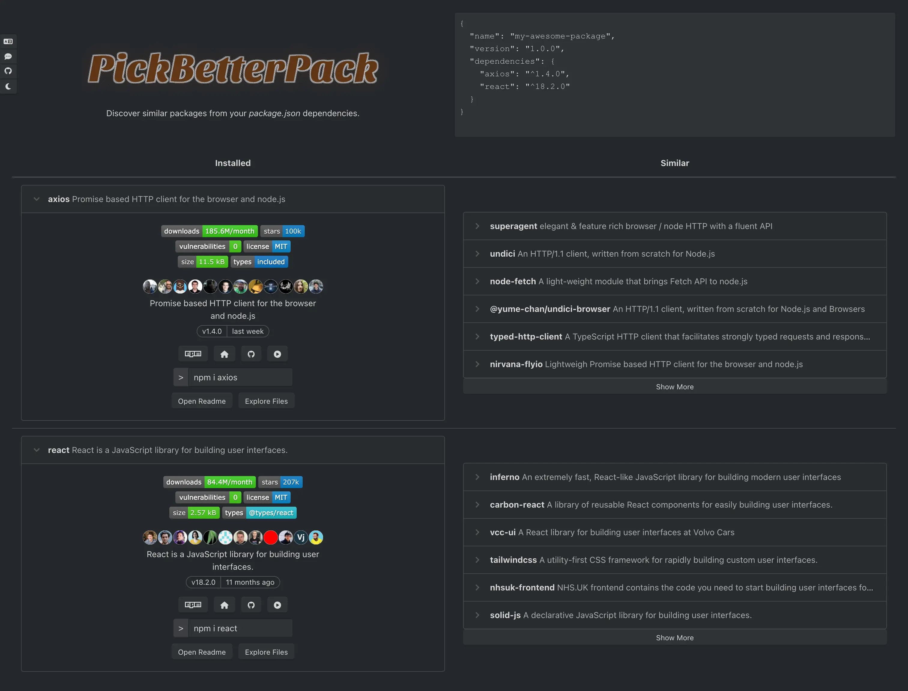

   
  
Discover similar packages from your <em>package.json</em> dependencies at <b><a href="https://pickbetterpack.com/">pickbetterpack.com</a></b>

PickBetterPack is a web tool for discovering similar NPM packages based on dependencies listed in a <em>package.json</em>.

Free and easy to use, it aims to save users time when looking for alternative packages for their projects.

